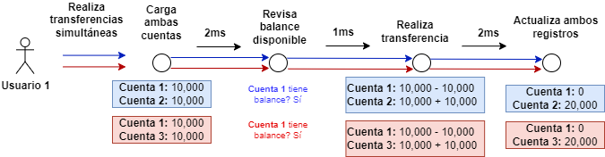

# Demo de Race Conditions




Este repositorio forma parte de la demostración de los race conditions en el HackConRD 2024, usando como demo un proyecto que emula un banco y se procede a ejecutar transacciones simultáneas explotando este fallo, ocasionando que el dinero se multiplique entre cuentas. El presente proyecto es para fines educativos.


Requisitos para ejecutar la demo
- Git
- Docker (instrucciones de instalación en https://docs.docker.com/engine/install/)

## Instalación

### Clonar el proyecto y entrar en la carpeta
```bash
git clone https://github.com/angel02/VulnerableBank.git
cd VulnerableBank
```

### Ejecutar los contenedores
```bash
docker compose up -d
```
    
## Usuarios y cuentas

| Usuario           | Nombre | Contraseña   | Cuentas           |
| :---------------- | :----- | :----------- | :--------------- |
| `user1@gmail.com` | Jhon   |`Test12345.` | 1001, 1002, 1003 |
| `user2@gmail.com` | Anna   |`Test12345.` | 2001, 2002, 2003 |
| `user3@gmail.com` | Carlos |`Test12345.` | 3001, 3002, 3003 |


## Demo

### 1. Ingresar a la demo e iniciar sesión con algun usuario
http://localhost:8080


### 2. Acceder a transferencias a terceros
http://localhost:8080/TransferenciaTerceros


### 3. Abrir consola del navegador presionando la tecla F12 y haciendo click en la pestaña "Console"

### 4. Copiar contenido del exploit y ejecutar ([Link al exploit](VulnerableBank/ExploitTerceros.js))


## Disclaimer:

La información presentada aquí sobre race conditions es solo con fines educativos e informativos. No constituye asesoramiento profesional y no nos hacemos responsables de cualquier consecuencia derivada de su uso o aplicación. Siempre haga un uso ético de la información en beneficio de la sociedad.
